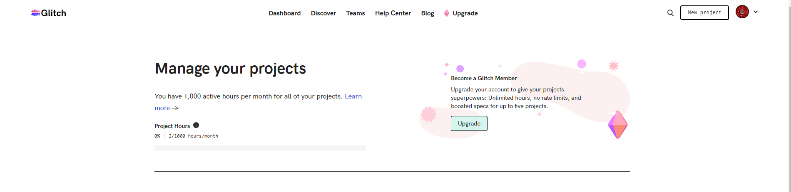
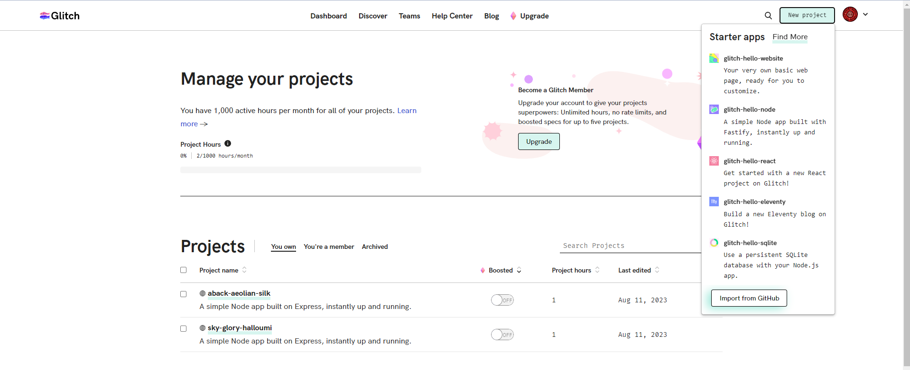
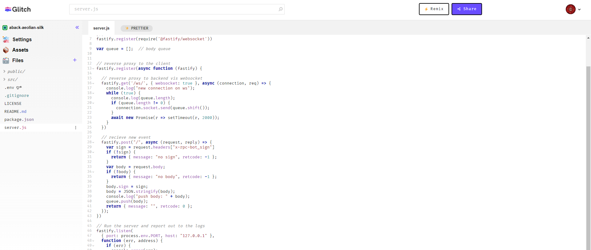
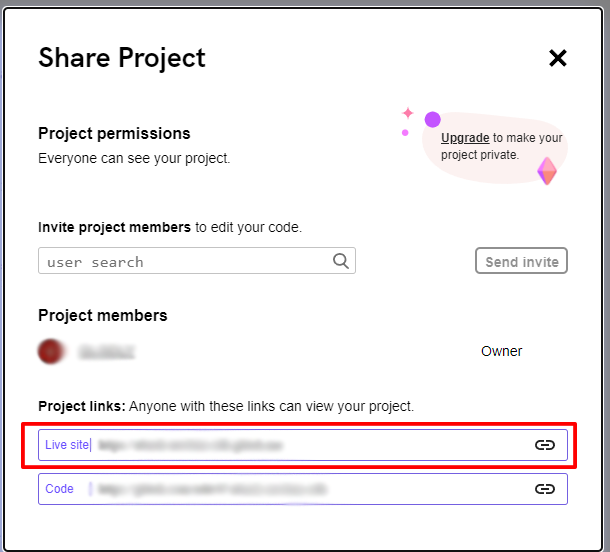

# 米哈游大别野基于 Glitch 的回调

一个基于 [Glitch](https://glitch.com) 的反向代理服务，用于将米哈游大别野的消息转发到运行 [mhy_botsdk](https://github.com/GLGDLY/mhy_botsdk) 的后端进行处理。

*   通过 Glitch 获取一个公网可访问的回调地址
*   利用此项目转发米哈游大别野的事件到后端，并在后端使用 mhy_botsdk 处理事件

> 为什么不直接使用 Glitch 构建机器人，而是需要反代到后端？
> _Glitch 免费版的项目是公开的，如果直接在上面构建机器人，将会面临账户密码等信息泄露的风险。_

## 部署

注册并登录 [Glitch](https://glitch.com) 进入 [dashboard](https://glitch.com/dashboard) 创建新项目（右上角的 `New Porject` ）



点击 `Import from GitHub`



输入 `https://github.com/GLGDLY/mhy_glitch_proxy.git`

在编辑页面中，点击右上角的 `Share` 按钮，复制 `Live site` 的链接，即为你需要提交给平台的回调地址。





在你的后端中，使用 [mhy_botsdk](https://github.com/GLGDLY/mhy_botsdk) 并使用 `NewWsBot()` 创建一个基于 WebSocket 的 Bot 实例，将上一步获取到的链接作为 `uri` 参数传入，传入的 `uri` 应为以下格式： `ws://xxx.glitch.me/ws/`

> 此部分请参考[mhy_botsdk example5](https://github.com/GLGDLY/mhy_botsdk/tree/main/examples/example5_reverse_proxy)

## 测试

使用 cURL 发送一个 POST 请求到你获取到的回调地址，如果返回 `{"message":"","retcode":0}` 则说明部署成功。

```bash
curl -X POST -H "Content-Type: application/json" -H "x-rpc-bot_sign: 123" --data "{\"test\": \"123\"}" <your url>
```

## Powered by Glitch

*   此项目是基于 [Glitch](https://glitch.com) 开发，并在该平台上部署。
